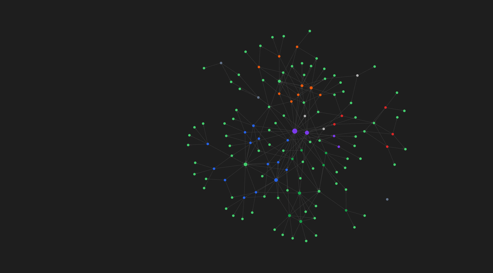

# Matteo Passeri - Operations Systems Portfolio

Sanitized case studies for operations systems, CRM workflows, ERP transition, quote-to-cash visibility, n8n automation, and AI-assisted implementation.

# Matteo Passeri - Operations Systems Portfolio

Sanitized case studies for operations systems, CRM workflows, ERP transition, quote-to-cash visibility, n8n automation, and AI-assisted implementation.

I build practical operating systems for small teams: lead intake, qualification workflows, quoting, pipeline visibility, reporting, alerting, SOPs, and handoff documentation.

The real source repositories remain private to protect client data, business logic, workflow exports, credentials, endpoints, and operational details. This repository is the public proof layer: outcomes, architecture summaries, and sanitized case studies.

Open to **full-remote EU roles** in Operations, Implementation, CRM / Workflow Automation, Marketing Ops, Growth Ops-adjacent work, and AI Workflow operations.

## Focus Areas

- Model Context Protocol (MCP) & Multi-Agent Context Engineering
- Git-backed, event-driven Personal Knowledge Management (PKM) systems
- Lead lifecycle management: intake, qualification, scoring, routing
- CRM-style handoff: structured fields, alerts, status tracking, fallback paths
- Quote-to-cash visibility: clients, quotes, work logs, delivery, P&L
- ERP transition and process standardization
- n8n automation and operational alerting
- Pipeline reporting and dashboard foundations
- SQL fundamentals and data hygiene
- Documentation, SOPs, and operational handoff

## Selected Systems

### The Agentic Second Brain: Git-Backed Multi-Agent MCP Knowledge Vault (Flagship Project)

A secure context-delivery and memory architecture built to support local and cloud-based AI agents (Claude Code, Codex CLI, custom ChatGPT connectors). By mapping structured operations, personal capabilities, and system runbooks into a Git-versioned Markdown database, this system provides AI agents with instant, high-density context. Includes event-driven Python watchdog autosync daemons and remote R/W Model Context Protocol (MCP) server endpoints behind Caddy.

Case study: [case-studies/agentic-knowledge-vault-mcp.md](case-studies/agentic-knowledge-vault-mcp.md)

### AI-Assisted Lead Qualification & Booking Funnel

A live consulting site connected to a private lead lifecycle workflow. The system replaces a typical "contact form into nowhere" flow with a documented operating pipeline: form intake, deterministic pre-checks, LLM-assisted scoring and brief generation, CRM storage, Calendly event handling, Telegram alerts, email fallbacks, and handoff logic.

Public site: https://aienabledops.it

Case study: [case-studies/ai-enabled-ops-funnel.md](case-studies/ai-enabled-ops-funnel.md)

### ME3Design ERP / Manager Pro

A private ERP-style operations platform built for a custom 3D printing workflow. It covers clients, projects, quoting, estimate support, work logs, delivery and archive workflow, P&L visibility, analytics, lead webhooks, and AI-assisted estimation.

Operating outcome: quote turnaround reduced from about 25 minutes to under 2 minutes.

Case study: [case-studies/custom-3d-printing-erp.md](case-studies/custom-3d-printing-erp.md)

### Self-Hosted n8n Automation Layer

An Oracle Cloud automation layer running active workflows for lead qualification, email triage, job screening, outreach, intelligence feeds, alerts, and operational support.

Case study: [case-studies/self-hosted-n8n-automation-layer.md](case-studies/self-hosted-n8n-automation-layer.md)

### 3D Services Commercial Website

A public commercial website for a 3D scanning and design workflow, built to connect service presentation to structured quote intake and the internal operating system.

Live site: https://me3design.it

Case study: [case-studies/3d-services-website.md](case-studies/3d-services-website.md)

## Screenshots and Walkthroughs

This sanitized context map is a public visual proof of the way I structure operational knowledge for AI-assisted work: project state, implementation notes, workflow documentation, reusable runbooks, and handoff material.

It does not expose private source code, client data, credentials, endpoints, workflow IDs, or internal labels. More detailed walkthroughs can be provided on call with sanitized data.

## Public Sharing Rule

Real source repositories remain private. The safer public approach is:

1. Keep operational source private.
2. Publish sanitized case studies, screenshots, and architecture notes.
3. Link to live public sites where appropriate.
4. Provide live demos and walkthroughs on call instead of exposing internal source.

See [SANITIZATION-CHECKLIST.md](SANITIZATION-CHECKLIST.md) before making any source or screenshot public.

## Contact

- Email: matteo.passeri.407@outlook.it
- LinkedIn: https://linkedin.com/in/matteo-passeri-me3d
- Site: https://aienabledops.it
