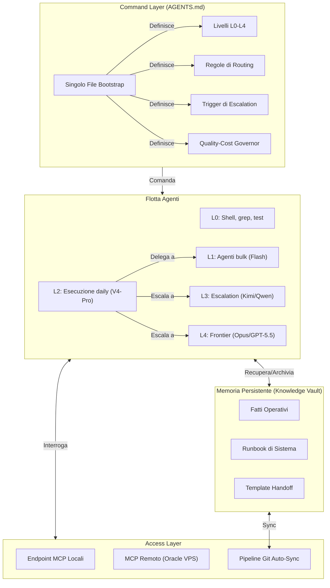

# Architettura di Orchestrazione Multi-Agente: Command, Memory & Coordination Layer

## Sintesi

Un'architettura in produzione che orchestra agenti AI su più livelli di capacità (L0 deterministico fino a L4 frontier), ambienti di esecuzione (OpenCode Go, Codex, locale) e dispositivi. Combina un command layer unico, regole di delega a livelli, protocolli di handoff automatizzati, endpoint Model Context Protocol (MCP) e memoria persistente Git-backed in un unico sistema operativo per il lavoro AI-assisted.

Il sistema non si limita a memorizzare contesto. **Governa** come operano gli agenti: quale modello gestisce quale task, quando escalare, come delegare e quali verifiche devono passare prima che il lavoro sia dichiarato concluso.

*Nota: Questo caso studio è sanificato. Identità degli agenti, IP, credenziali, runbook privati e dettagli di produzione sono esclusi.*

---

## Il Problema dell'Orchestrazione

Usare AI agent efficacemente non è un problema di qualità del modello. È un problema di coordinamento:

1. **Nessuna Dottrina Operativa Condivisa:** Ogni sessione agente parte da zero. Senza un command layer unificato, gli agenti divergono, duplicano lavoro o sconfinano in task oltre il loro livello.
2. **Nessun Routing a Livelli:** Far girare ogni task su un modello frontier brucia budget. Far girare task complessi su modelli economici produce output inaffidabile. Senza regole esplicite, succedono entrambe le cose.
3. **Nessuna Memoria Persistente:** Gli agenti dimenticano tra una sessione e l'altra. Ricostruire il contesto spreca token e introduce inconsistenza.
4. **Nessun Protocollo di Escalation:** Quando un agente economico fallisce, ritenta ciecamente invece di escalare. Quando arriva un task complesso, nessun gate determina se serve giudizio frontier.

---

## L'Architettura: 4 Layer

### Layer 1: Il Command Layer (AGENTS.md)

Un singolo file bootstrap compatto è la dottrina operativa per ogni agente che tocca il sistema. Definisce:

- **Livelli di Capacità (L0-L4):** Esattamente quale modello o strumento gestisce quale classe di task. L0 per comandi deterministici, L1 per bulk/scansioni, L2 per esecuzione quotidiana, L3 per escalation, L4 per giudizio frontier.
- **Regole di Routing a Livelli:** Regole di partenza (sempre L2 first), de-escalation (delega automatica verso il basso), trigger di escalation (due fallimenti, alta ambiguità, sicurezza/azioni irreversibili).
- **Quality-Cost Governor:** "Massimizzare output verificato di qualità alta per token frontier consumato." Proibisce sia lavoro cheap che produce output mediocre, sia spreco frontier su task che shell o modelli economici possono gestire.
- **Template di Handoff:** Formato canonico per delegare lavoro verso il basso e riportare risultati verso l'alto. Previene perdita di contesto tra handoff.

### Layer 2: La Flotta Agenti

Molteplici modelli AI che operano sotto un'unica dottrina, su runtime diversi:

- **Stesso bootstrap, modelli diversi:** Ogni agente — dagli scanner bulk economici ai giudici frontier — legge lo stesso AGENTS.md. Il bootstrap definisce il loro ruolo, non la loro scheda tecnica.
- **Coordinamento cross-runtime:** Gli agenti L2 in OpenCode Go possono richiamare agenti L3 nello stesso runtime, o segnalare e fermarsi per review L4 frontier su runtime diversi.
- **Delega a sub-agenti:** I planner L2 decompongono i task e li distribuiscono a worker L1, poi revisionano e uniscono i risultati.

### Layer 3: Memoria Persistente (Knowledge Vault)

Una base di conoscenza Markdown versionata con Git, strutturata per retrieval mirato:

- **Requirements-First Routing:** Gli agenti devono leggere prima l'indice, poi recuperare solo la nota specifica necessaria — niente precaricamento di alberi interi.
- **Isolamento di Sicurezza:** Credenziali e configurazioni runtime private restano fuori dal ciclo di sync. Solo puntatori non sensibili sono documentati.
- **Coerenza Multi-Dispositivo:** La stessa base di conoscenza si sincronizza tra desktop Windows, laptop Fedora e VPS cloud tramite pipeline Git automatizzate.

### Layer 4: Access Layer (MCP + Git Sync)

- **Endpoint MCP Locali:** Gli agenti locali interrogano il vault con latenza quasi zero.
- **MCP Remoto (Oracle VPS):** Agenti cloud e workflow n8n recuperano contesto tramite endpoint autenticati e limitati.
- **Auto-Sync Event-Driven:** Un daemon leggero monitora le modifiche al vault, applica debounce, committa e pusha su un remote Git privato.
- **Scritture Protette:** Le operazioni di scrittura sono serializzate, tracciate via Git, con gestione conservativa dei conflitti.

---

## Cosa Abilita (Oltre la Memoria)

| Capacità | Senza Questa Architettura | Con Questa Architettura |
|---|---|---|
| L'agente inizia una nuova sessione | Briefing manuale, contesto perso | Legge bootstrap → conosce ruolo, regole, limiti |
| Task troppo complesso per il tier corrente | Retry cieco, fallimento silenzioso | Regola dei due fallimenti → escalation automatica |
| Task banale / bulk | Modello frontier sprecato | De-escalation automatica a L1 |
| Lavoro fatto da sub-agente | Contesto perso, risultati non verificati | Rientro via template: risultato, file toccati, verifica, rischi |
| Nuovo dispositivo o agente si unisce | Setup manuale, configurazione inconsistente | Clona vault → legge AGENTS.md → operativo |
| Controllo costi | Nessuna visibilità, abuso frontier | Governor qualità-costo integrato in ogni agente |

---

## Risultati Ottenuti

- **Coordinamento Multi-Agente Autonomo:** Gli agenti si auto-instradano in base al rischio e complessità del task. Nessun dispatcher umano necessario per il lavoro di routine.
- **Zero Spreco di Bootstrap:** Una nuova sessione agente costa la lettura di un file (AGENTS.md) più solo le note specifiche del task. Niente dump di contesto completo.
- **Antifragilità Cross-Provider:** L'architettura è provider-agnostica. Se un vendor di modelli va giù, gli agenti passano al tier successivo disponibile.
- **Gates di Qualità Verificabili:** Nessun agente può dichiarare il lavoro "fatto" senza mostrare verifica (test passati, build verde, diff revisionato).

---

## Sviluppi Futuri: OpsVault

Questa architettura è in fase di estrazione in un progetto pubblico di riferimento (**OpsVault**) con template riusabili, regole di sanitizzazione, script di bootstrap e una reference architecture sicura.

L'implementazione privata — topologia di produzione, identità degli agenti, credenziali, esportazioni workflow e contenuto del vault personale — resta privata e può essere discussa in walkthrough live con esempi sanificati.
