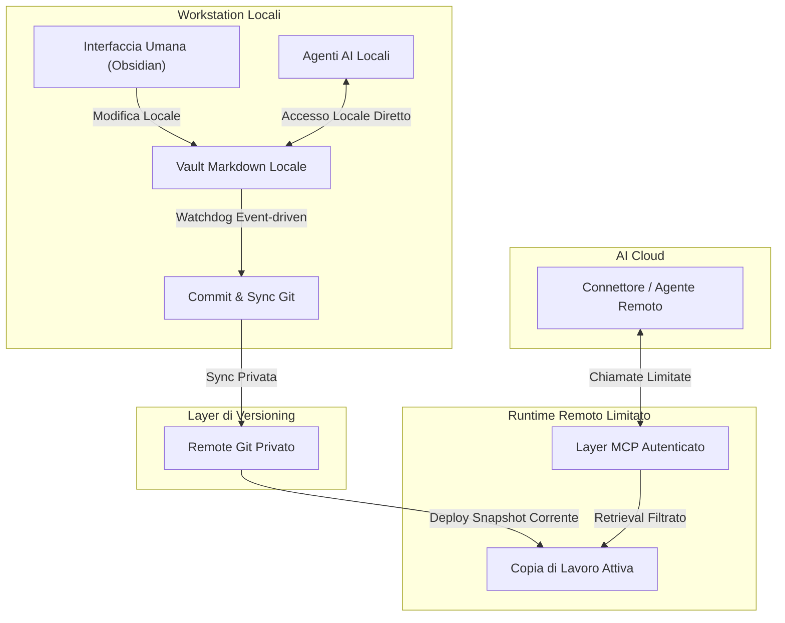

# Il Secondo Cervello Agentico: Architettura di Conoscenza Multi-Agente Sincronizzata via Git

## Sintesi
Un'architettura funzionante di persistenza del contesto e memoria operativa, progettata per supportare agenti AI locali e cloud. Mappando operazioni strutturate, limiti decisionali e procedure in una base di conoscenza Markdown tracciata con Git, questo sistema fornisce agli agenti AI contesto operativo mirato senza esporre note private grezze.

Questa architettura affronta il problema della "perdita di contesto" (*context drift*) e dello spreco di token attraverso un protocollo di recupero mirato, sincronizzazione basata su Git e pattern di accesso MCP (Model Context Protocol) limitati.

*Nota: Questo caso studio è sanificato. Indirizzi IP, domini, token di sicurezza, percorsi di sistema privati, dettagli di gestione credenziali e contenuti del vault privato sono esclusi intenzionalmente.*

---

## Il Problema Operativo
Quando si collabora con agenti AI avanzati per lo sviluppo di codice e l'automazione su più dispositivi, emergono tre sfide critiche:
1. **Perdita di Contesto e Inefficienza dei Token:** Gli agenti AI perdono la memoria tra una sessione e l'altra. Ricostruire ogni volta il contesto manualmente o caricare interi blocchi di file non correlati intasa la finestra di contesto del modello e fa impennare i costi di consumo dei token.
2. **Rischi di Sicurezza:** Memorizzare informazioni sensibili (credenziali, webhook di API, dati dei clienti) direttamente nelle cartelle di lavoro o nei prompt di testo porta a inevitabili leak di sicurezza.
3. **Attrito di Sincronizzazione:** Mantenere aggiornata la memoria operativa su più workstation fisiche (es. laptop Fedora Linux, desktop Windows) e ambienti di automazione cloud senza dover fare continui copia-incolla manuali.

---

## L'Architettura Costruita

### Layer 1: Il Vault Markdown Canonico (Base di Conoscenza)
La fondazione è un vault Obsidian in Markdown strutturato appositamente per un recupero ad alta precisione (*retrieval-first*). Funge da singola fonte di verità per fatti, limiti operativi, progetti attivi, guide operative e brand voice.
* **Requirements-First Routing:** Un protocollo di ingresso rigoroso obbliga gli agenti a leggere prima la mappa dell'indice e poi ad accedere esclusivamente alla singola nota utile per il task corrente.
* **Isolamento di Sicurezza:** Le credenziali in chiaro sono escluse dal ciclo di sync. Nel layer di conoscenza restano solo puntatori non sensibili; credenziali e configurazioni runtime private restano fuori dal materiale pubblico.

### Layer 2: Pipeline di Sincronizzazione e Deployment Ibrida
Gli aggiornamenti della memoria operativa sono completamente automatizzati tramite Git e un daemon locale leggero:
* **Autosync Event-Driven:** Un daemon Python leggero rileva le modifiche ai file del vault, applica un debounce per evitare rumore, committa le modifiche validate e le sincronizza su un remote privato.
* **Deployment lato Cloud:** Un runtime remoto limitato riceve lo snapshot corrente e rende disponibile solo la superficie di retrieval necessaria agli agenti autorizzati.

### Layer 3: Layer di Accesso Model Context Protocol (MCP)
Per rendere questo "secondo cervello" accessibile agli assistenti AI in modo sicuro, l'implementazione separa accesso locale, retrieval remoto autenticato e scritture protette:
1. **Accesso Locale:** Gli agenti sulla macchina locale interrogano il vault locale con latenza minima.
2. **Retrieval Remoto Autenticato:** Agenti cloud e connector possono recuperare solo note selezionate tramite una superficie MCP limitata.
3. **Scritture Protette:** Le operazioni di scrittura restano private, serializzate e tracciate via Git, con gestione conservativa dei conflitti.

---

## Risultati Ottenuti
* **Bootstrap Rapido degli Agenti:** Una nuova sessione parte da una mappa compatta e recupera solo le note richieste dal task corrente.
* **Meno Spreco di Contesto:** Invece di caricare documenti interi o istruzioni pesanti, gli agenti recuperano file Markdown brevi e mirati on demand.
* **Coerenza Multi-Workstation:** Gli aggiornamenti durevoli possono essere sincronizzati tra workstation preservando storia Git e revisionabilità.

---

## Sviluppi Futuri: OpsVault

Questa architettura è in fase di refactoring verso un progetto pubblico più piccolo chiamato **OpsVault**.

La release pubblica punterà su template riusabili, regole di sanitizzazione, script di bootstrap locali e una reference architecture sicura. I dettagli dell'implementazione privata, la topologia production, le credenziali e il contenuto del vault personale resteranno privati e potranno essere discussi in walkthrough live con esempi sanificati.

In questo modo il valore da portfolio resta visibile senza pubblicare una copia diretta del sistema operativo privato.
