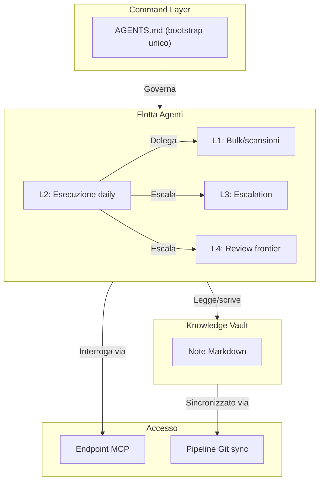

# Architettura di Orchestrazione Multi-Agente: Command, Memory & Coordination Layer

## Sintesi

Un'architettura funzionante che coordina agenti AI su più livelli di capacità (L0-L4), ambienti di esecuzione (OpenCode Go, Codex, locale) e dispositivi fisici. Un singolo file bootstrap versionato con Git governa il comportamento di ogni agente: quali task gestisce, quando escalare, come delegare e quale verifica è richiesta prima di dichiarare il lavoro concluso.

Il sistema è in uso quotidiano. Non è un blueprint — è il layer operativo attraverso cui passa tutto il lavoro AI-assisted. Endpoint Model Context Protocol (MCP) espongono la base di conoscenza ad agenti e workflow di automazione con controlli di accesso differenziati.

*Nota: Questo caso studio è sanificato. Topologia di produzione, identità degli agenti, credenziali e contenuto del vault privato sono esclusi.*

---

## Cosa Risolve

Prima di questa architettura, ogni sessione agente era un'isola. Briefing manuale a ogni avvio. Perdita di contesto tra sessioni. Modelli frontier sprecati su task banali. Nessun modo coerente per passare lavoro tra agenti o verificare il completamento. Nessuna memoria condivisa tra dispositivi.

L'architettura affronta tutto questo con quattro layer integrati, tutti versionati in Git ed esposti via MCP.

---

## Architettura

### Command Layer

Un singolo file `AGENTS.md` definisce la dottrina operativa condivisa da ogni agente. Specifica:

- **Livelli di capacità (L0-L4):** quale modello o strumento per quale classe di task
- **Routing predefinito:** si parte sempre da L2, de-escalation automatica verso il basso, escalation verso l'alto su trigger definiti
- **Trigger di escalation:** due fallimenti consecutivi, alta ambiguità, lavoro sensibile/irreversibile, giudizio UI/design
- **Formato delega/handoff:** template canonico per passare lavoro tra agenti senza perdita di contesto
- **Quality-cost governor:** la regola che governa ogni decisione di routing

### Flotta Agenti

Modelli multipli su provider multipli, tutti sotto lo stesso bootstrap:

- **L2 (DeepSeek V4-Pro via OpenCode Go)** è il default quotidiano per coding, n8n, shell, repo
- **L1 (V4-Flash, Gemini Flash)** gestisce estrazioni bulk, scansioni, trasformazioni meccaniche
- **L3 (Kimi K2.7, Qwen3.7-Max)** subentra su escalation segnalata, stesso runtime
- **L4 (Codex/GPT-5.5, Opus 4.8)** è riservato ad architettura, sicurezza, giudizio finale — cross-runtime

Gli agenti non chattano tra loro. Il coordinamento avviene tramite le regole del bootstrap, i template di handoff e lo stato condiviso nel vault.

### Memoria Persistente

Base di conoscenza Markdown versionata con Git, organizzata per retrieval mirato. Gli agenti leggono prima l'indice, poi recuperano solo le note necessarie — nessun precaricamento di alberi completi. Le credenziali restano fuori dal ciclo di sync.

### Access Layer

- **MCP locale:** gli agenti sulla stessa macchina interrogano il vault direttamente
- **MCP remoto (Oracle VPS):** agenti cloud e workflow n8n recuperano contesto via endpoint autenticati
- **Git auto-sync:** un daemon leggero monitora le modifiche, committa e pusha su un remote privato

---

## In Pratica

| Situazione | Comportamento |
|---|---|
| Nuova sessione agente | Legge AGENTS.md → conosce tier, regole, limiti |
| Task oltre il tier corrente | Regola dei due fallimenti → escalation automatica |
| Task banale / bulk | De-escalation automatica a L1, zero token frontier |
| Sub-agente completa lavoro | Rientra via template: risultato, file toccati, verifica, rischi |
| Nuovo dispositivo si unisce | Clona vault → legge bootstrap → operativo |

---

## Risultati

- **Dottrina operativa condivisa** tra tutti gli agenti e dispositivi. Nessuna deriva di configurazione.
- **Bootstrap token-efficient.** Una nuova sessione costa la lettura di un file compatto più le note specifiche — non dump completi.
- **Provider-agnostico.** Se un vendor va giù, gli agenti instradano al tier successivo senza riconfigurazione.
- **Gates di verifica.** Nessun agente dichiara il lavoro concluso senza mostrare evidenza (test passati, build verde, diff revisionato).

---

## Sanitizzazione

Questo caso studio descrive l'architettura e il suo comportamento operativo. Non espone il contenuto del vault privato, le identità degli agenti, la topologia di produzione, le credenziali o gli interni dei workflow. Walkthrough live con esempi sanificati disponibili su richiesta.
