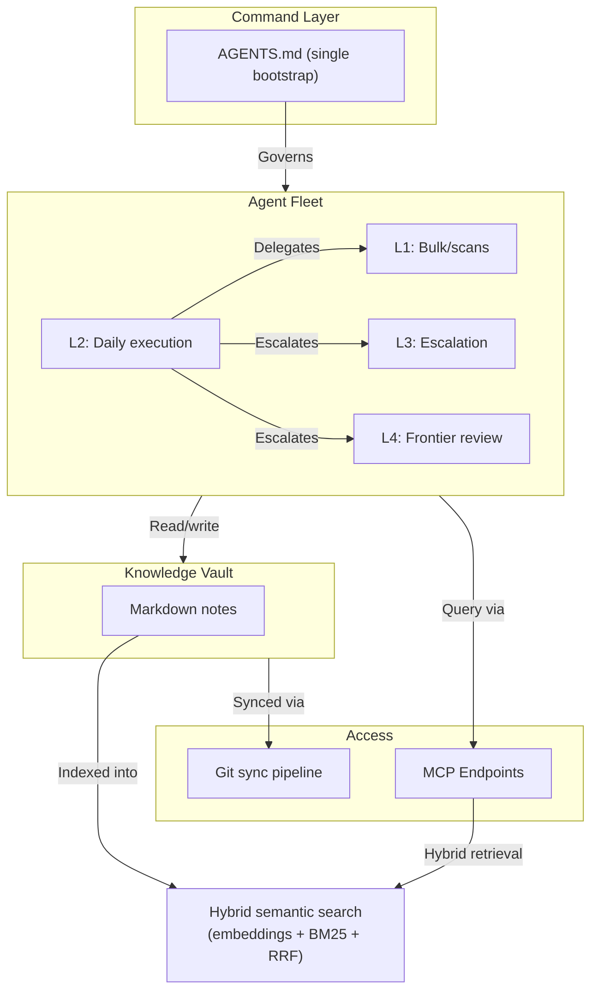

# Multi-Agent Orchestration Architecture: Git-Backed Command, Memory & Coordination Layer

## Summary

A working architecture that coordinates multiple AI agents across capability tiers (L0 through L4), runtime environments (OpenCode Go, Codex, local), and physical devices. A single Git-versioned bootstrap file governs every agent's behavior: which tasks it handles, when to escalate, how to delegate, and what verification is required before work is declared complete.

The system is in daily use. It is not a blueprint — it is the operating layer through which all AI-assisted work flows. Model Context Protocol (MCP) endpoints expose the knowledge base to agents and automation workflows with tiered access controls.

*Note: This case study is sanitized. Production topology, agent identities, credentials, and private vault content are excluded.*

---

## What It Solves

Before this architecture, every AI agent session was an island. Manual re-briefing. Context drift between sessions. Frontier models wasted on bulk tasks. No consistent way to hand off work between agents or to verify completion. No shared memory across devices.

The architecture addresses this with four integrated layers, all versioned in Git and exposed through MCP.

---

## Architecture

### Command Layer

A single `AGENTS.md` file defines the operating doctrine shared by every agent. It specifies:

- **Capability tiers (L0-L4):** which model or tool for which task class
- **Default routing:** always start at L2, de-escalate downward automatically, escalate upward on defined triggers
- **Escalation triggers:** two consecutive failures, high ambiguity, security-sensitive or irreversible work, UI/design judgment
- **Delegation/handoff format:** a canonical template for passing work between agents without context loss
- **Quality-cost governor:** the rule that governs every routing decision

### Agent Fleet

Multiple models across multiple providers, all reading the same bootstrap:

- **L2 (DeepSeek V4-Pro via OpenCode Go)** is the daily default for coding, n8n, shell, repo work
- **L1 (V4-Flash, Gemini Flash)** handles bulk extraction, scans, mechanical transforms
- **L3 (Kimi K2.7, Qwen3.7-Max)** takes over on signaled escalation within the same runtime
- **L4 (Codex/GPT-5.5, Opus 4.8)** is reserved for architecture, security, final judgment — cross-runtime

Agents don't chat with each other. Coordination happens through the bootstrap rules, handoff templates, and the shared vault state.

### Persistent Memory

A Git-versioned Markdown knowledge base organized for targeted retrieval. Agents read the index first, then pull only the specific notes needed — no preloading full trees. Credentials stay outside the sync loop.

### Semantic Retrieval Layer (Hybrid RAG)

Targeted retrieval is backed by a self-hosted **hybrid search layer** over the vault — the retrieval foundation for RAG-style, source-grounded agent answers. The work here was not writing the algorithm; it was the **design, integration, and validation decisions** under real constraints: no external embeddings API (recurring cost, vault data leaving the host) and no GPU. The chosen approach runs entirely on CPU and combines:

- **Static embeddings** (multilingual, CPU-only) for meaning-based matching
- **BM25** lexical search over context-enriched chunks
- **Reciprocal-rank fusion** of both signals, plus a **title/alias boost** so the canonical note on a topic outranks notes that merely mention it
- **Bilingual query expansion (IT/EN)** so plain-language questions reach technical notes written in English

The path mattered as much as the result: a heavier transformer model was ruled out (too slow without a GPU), an external embedding API was ruled out (cost and data exposure), and when raw semantic quality plateaued the answer was to add lexical signal — not to pay for a bigger model. Every choice was validated against a real query set and measured, not assumed. Implementation was AI-assisted; the architecture, trade-offs, and verification were the deciding work. The layer is served to agents through the same MCP endpoints, with no vault content leaving the host.

### Access Layer

- **Local MCP:** agents on the same machine query the vault directly
- **Remote MCP (Oracle VPS):** cloud agents and n8n workflows retrieve context through authenticated endpoints
- **Git auto-sync:** a lightweight daemon monitors changes, commits, and pushes to a private remote

---

## What It Looks Like In Practice

| Situation | Behavior |
|---|---|
| New agent session starts | Reads AGENTS.md → knows its tier, rules, and limits immediately |
| Task exceeds current tier | Two-failure rule triggers escalation to next tier up |
| Task is trivial/bulk | Automatic de-escalation to L1, no frontier tokens burned |
| Sub-agent completes work | Returns via handoff template: result, files touched, verification status, open risks |
| New device joins | Clones vault → reads bootstrap → operational |

---

## Outcomes

- **Shared operating doctrine across all agents and devices.** No per-agent configuration drift.
- **Token-efficient bootstrapping.** A new session costs one compact file read plus task-specific notes, not full-context dumps.
- **Provider-agnostic.** If a model vendor has an outage, agents route to the next available tier without reconfiguration.
- **Verification gates.** No agent declares work done without showing evidence (tests passing, build green, diff reviewed).

---

## Sanitization

This case study describes the architecture and its operational behavior. It does not expose the private vault content, agent identities, production topology, credentials, or workflow internals. Live walkthroughs with sanitized examples are available on request.
