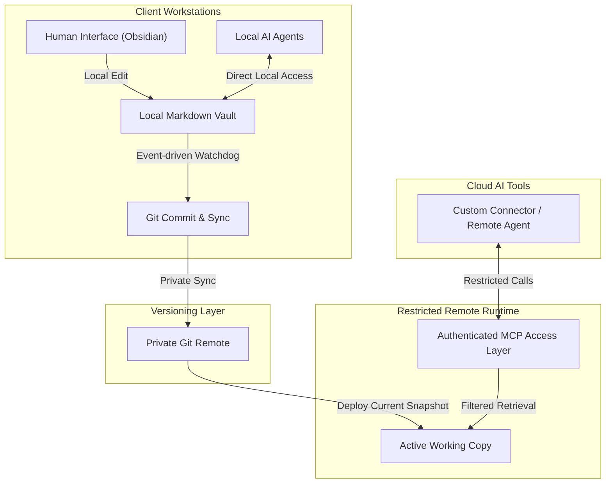

# The Agentic Second Brain: Git-Backed Multi-Agent Knowledge Architecture

## Summary
A working secure context-delivery and memory architecture built to support local and cloud-based AI agents. By mapping structured operations, capability boundaries, and system runbooks into a Git-versioned Markdown knowledge base, this system provides AI agents with targeted operational context without exposing raw private notes.

This architecture addresses "context drift" and token waste through a strict retrieval protocol, Git-backed synchronization, and restricted Model Context Protocol (MCP) access patterns.

*Note: This case study is sanitized. Server IPs, domains, security tokens, private system paths, credential storage details, and private note contents are intentionally excluded.*

---

## The Operational Problem
When collaborating with advanced AI coding and automation agents across different devices, three major challenges arise:
1. **Context Drift & Inefficiency:** AI agents lose context between sessions, requiring manual bootstrapping or massive, repetitive file dumps that clutter the context window and drive up token consumption.
2. **Security Risks:** Storing sensitive information (credentials, API webhooks, client data) directly in active workspaces or in plain-text prompts leads to inevitable security leaks.
3. **Synchronicity & Friction:** Keeping operational memory updated across multiple physical workstations (e.g., Fedora Linux laptops, Windows desktops) and cloud-based automation environments without manual copy-pasting.

---

## The 4-Layer Architecture Built

### Layer 1: The Canonical Markdown Vault (Knowledge Layer)
The foundation is a structured Obsidian-compatible Markdown vault organized for precision retrieval. It acts as the single source of truth for facts, capability limits, active projects, system runbooks, and brand voice.
* **Requirements-First Routing:** A strict entry-point protocol forces agents to read the map first and then query only the specific note required for the active task.
* **Security Isolation:** Plain-text credentials are banned from the sync loop. Only non-sensitive recovery pointers are documented; actual credentials and private runtime configuration stay outside the public knowledge layer.

### Layer 2: Hybrid Sync & Deployment Pipeline
Memory updates are entirely automated using Git and a lightweight local daemon:
* **Event-Driven Auto-Sync:** A lightweight Python daemon monitors vault changes, debounces noisy file saves, commits validated changes, and syncs them to a private remote.
* **Server-Side Deployment:** A restricted remote runtime receives the newest sanitized snapshot and exposes only the retrieval surface needed by trusted agents.

### Layer 3: Model Context Protocol (MCP) Access Layer
To make this second brain accessible to AI assistants safely, the implementation separates local access, authenticated remote retrieval, and protected write flows:
1. **Local Access:** Local agents query the local vault instance for fast, low-friction context.
2. **Authenticated Remote Retrieval:** Cloud agents and connectors can retrieve selected notes through a restricted MCP surface.
3. **Protected Writes:** Write operations remain private, serialized, and Git-backed, with conservative conflict handling.

---

## Core Outcomes
* **Fast Agent Bootstrapping:** A new agent session starts from a compact map and pulls only the notes required for the current task.
* **Lower Context Waste:** Instead of loading full documents or heavy instruction sets, agents retrieve short, focused Markdown files on demand.
* **Multi-Workstation Consistency:** Durable updates can be synchronized across workstations while preserving Git history and reviewability.

---

## What's Next: OpsVault

This architecture is being refactored into a smaller public project named **OpsVault**.

The public release will focus on reusable templates, sanitization rules, local bootstrap scripts, and a safe reference architecture. The private implementation details, production topology, credentials, and personal vault content will remain private and can be discussed in live walkthroughs with sanitized examples.

This keeps the portfolio value visible without publishing a direct clone of the private operating system.
