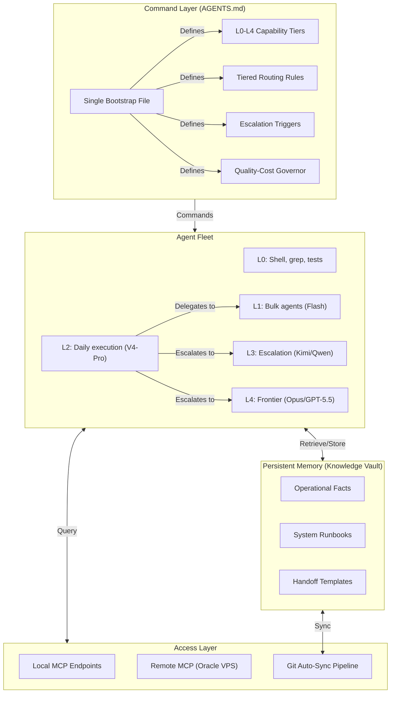

# Multi-Agent Orchestration Architecture: Git-Backed Command, Memory & Coordination Layer

## Summary

A production architecture that orchestrates multiple AI agents across capability tiers (L0 deterministic through L4 frontier), runtime environments (OpenCode Go, Codex, local), and devices. It combines a single-source-of-truth command layer, tiered delegation rules, automated handoff protocols, Model Context Protocol (MCP) endpoints, and Git-backed persistent memory into one operating system for AI-assisted work.

The system doesn't just store context. It **governs** how agents operate: which model handles which task, when to escalate, how to delegate, and what verification gates must pass before work is declared done.

*Note: This case study is sanitized. Agent identities, server IPs, credentials, private runbooks, and production workflow internals are excluded.*

---

## The Orchestration Problem

Using AI agents effectively is not a model-quality problem. It's a coordination problem:

1. **No Shared Operating Doctrine:** Every agent session starts from scratch. Without a unified command layer, agents drift, duplicate work, or overstep into tasks beyond their capability tier.
2. **No Tiered Routing:** Running every task through a frontier model burns budget. Running complex tasks through cheap models produces unreliable output. Without explicit routing rules, both happen.
3. **No Persistent Memory:** Agents forget between sessions. Rebuilding context wastes tokens and introduces inconsistency.
4. **No Escalation Protocol:** When a cheap agent fails, it retries blindly instead of escalating. When a complex task arrives, no gate determines whether it requires frontier judgment.

---

## The Architecture: 4 Layers

### Layer 1: The Command Layer (AGENTS.md)

A single, compact bootstrap file serves as the operating doctrine for every agent that touches the system. It defines:

- **Capability Tiers (L0-L4):** Exactly which model or tool handles which class of task. L0 for deterministic commands, L1 for bulk/scans, L2 for daily execution, L3 for escalation, L4 for frontier judgment.
- **Tiered Routing Rules:** Default-start rules (always L2 first), de-escalation rules (automatic downward delegation), escalation triggers (two failures, high ambiguity, security/irreversible work).
- **Quality-Cost Governor:** "Maximize verified high-quality output per frontier token consumed." Prohibits both cheap work that produces mediocre output and frontier waste on tasks shells or cheap models can handle.
- **Handoff Templates:** Canonical format for delegating work downward and reporting results upward. Prevents context loss between agent handoffs.

### Layer 2: The Agent Fleet

Multiple AI models operating under a single command doctrine, across different runtimes:

- **Same bootstrap, different models:** Every agent — from cheap bulk scanners to frontier judges — reads the same AGENTS.md. The bootstrap defines their role, not their model card.
- **Cross-runtime coordination:** L2 agents in OpenCode Go can summon L3 escalation agents in the same runtime, or signal-and-stop for L4 frontier review across runtimes.
- **Sub-agent delegation:** L2 planners decompose tasks and fan out to L1 workers, then review and merge results.

### Layer 3: Persistent Memory (Knowledge Vault)

A Git-versioned Markdown knowledge base structured for targeted retrieval:

- **Requirements-First Routing:** Agents must read the index first, then pull only the specific note needed — no preloading entire trees.
- **Security Isolation:** Credentials and private runtime configuration stay outside the sync loop. Only non-sensitive pointers are documented.
- **Multi-Device Consistency:** The same knowledge base syncs across Windows desktop, Fedora laptop, and cloud VPS via automated Git pipelines.

### Layer 4: Access Layer (MCP + Git Sync)

- **Local MCP Endpoints:** Local agents query the vault with near-zero latency.
- **Remote MCP (Oracle VPS):** Cloud agents and n8n workflows retrieve context through authenticated, restricted endpoints.
- **Event-Driven Auto-Sync:** A lightweight daemon monitors vault changes, debounces saves, commits, and pushes to a private Git remote.
- **Protected Writes:** Write operations are serialized, Git-backed, with conservative conflict handling.

---

## What This Enables (Beyond Memory)

| Capability | Without This Architecture | With It |
|---|---|---|
| Agent starts new session | Manual re-briefing, context drift | Reads bootstrap → knows role, rules, limits instantly |
| Task is too complex for current tier | Blind retry, silent failure | Two-failure rule triggers automatic escalation |
| Task is trivial/bulk | Frontier model wasted on it | Automatic de-escalation to L1 bulk agent |
| Work done by sub-agent | Context lost, results unverified | Returns via handoff template: result, files touched, verification, risks |
| New device or agent joins | Manual setup, inconsistent config | Clones vault → reads AGENTS.md → fully operational |
| Cost control | No visibility, frontier overuse | Quality-cost governor baked into every agent's decision loop |

---

## Core Outcomes

- **Autonomous Multi-Agent Coordination:** Agents self-route based on task risk and complexity. No human dispatcher needed for routine work.
- **Zero Bootstrap Waste:** A new agent session costs one file read (AGENTS.md) plus task-specific notes only. No full-context dumps.
- **Cross-Provider Antifragility:** The architecture is provider-agnostic. If a model vendor goes down, agents switch to the next available tier.
- **Verifiable Quality Gates:** No agent can declare work "done" without showing verification (test pass, build green, diff reviewed).

---

## What's Next: OpsVault

This architecture is being extracted into a public reference project (**OpsVault**) with reusable templates, sanitization rules, bootstrap scripts, and a safe reference architecture.

The private implementation — production topology, agent identities, credentials, workflow exports, and personal vault content — remains private and can be discussed in live walkthroughs with sanitized examples.

This keeps the portfolio value visible without publishing the private operating system.
