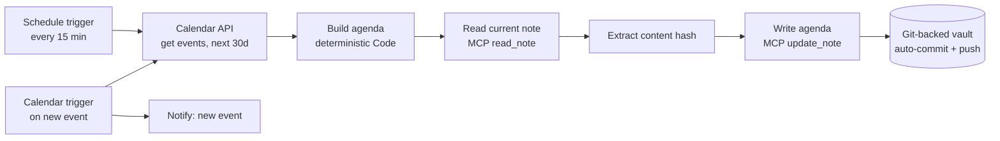

# Calendar → Vault Context Sync

*Keeping an AI agent's working memory aligned with my real calendar — automatically, deterministically, and without a fragile custom service.*

> This case study is intentionally sanitized. No source code, workflow exports, infrastructure addresses, endpoints, tokens, IDs, or personal data are reproduced — only the architecture, the decisions, and the outcome. The operational workflow remains private.

> Standalone demo repo (diagram, core logic, walkthrough): **[n8n-calendar-vault-sync](https://github.com/matteopasseri407/n8n-calendar-vault-sync)**.

---

## Context

I run a personal "ops stack": an n8n automation server and a **git-backed Markdown knowledge base** ("the vault") that several AI agents read from and write to through an authenticated **MCP** (Model Context Protocol) server.

The vault is the agents' shared memory. But one critical slice of reality lived *outside* it: my **calendar**. Every interview, call, or commitment had to be copied into the vault by hand, which meant:

- the agents reasoned about my week with stale or missing information;
- when an agent helped me plan the week, it had no idea I was already busy on a given day;
- every change to the calendar created manual reconciliation work.

**Goal:** the vault should always reflect my current commitments, with zero manual upkeep, so any agent reading it knows what I have on and can advise accordingly (e.g. *"don't book anything Thursday — you already have a commitment"*).

---

## Architecture

The pipeline fetches the authoritative set of upcoming events, renders **one** Markdown agenda file, and writes it back to the vault through the same MCP write contract every other agent uses. A git post-receive hook publishes the change to the working tree the agents read.

The agenda file is a single source of truth, grouped by day, plus a machine-friendly **"busy days"** line that the pipeline agent consumes directly.

> Related: this automation writes through the same MCP knowledge-vault layer described in the [Agentic Knowledge Vault](agentic-knowledge-vault-mcp.md) case study, and runs on the [Self-Hosted n8n Automation Layer](self-hosted-n8n-automation-layer.md).

---

## Key design decisions

### 1. Reconciliation, not event-by-event sync
The naïve approach — "write a note per event" — cannot represent **deletions**: cancel an event and its note lingers forever as a ghost commitment.

Instead, each run **regenerates the whole agenda file** from the current event set. Additions, edits, and removals are all handled by the same code path: if an event is gone, it simply isn't re-rendered. This is a declarative *desired-state* model rather than an imperative diff — far less code, far fewer edge cases.

### 2. Deterministic, no LLM in the hot path
An earlier draft used an LLM to "extract" fields from each event. But a calendar event is *already structured* — title, time, location, attendees. Putting a model there only added latency, cost, non-determinism, and a silent JSON-parse failure mode.

The final version parses fields directly and classifies event type with simple keyword rules. **Predictable, free, and debuggable** — the right tool for structured data.

### 3. Reuse the platform's write contract instead of a bespoke service
A first iteration wrote to the vault via a small custom HTTP service. It worked, but it was an unauthenticated endpoint with no path validation — exactly the kind of thing that fails a security review.

I replaced it with the vault's **existing MCP write tools** (`read_note` / `update_note`), reached over an authenticated HTTPS endpoint. Benefits:

- **No new attack surface** — same token-protected, guardrailed path (size limits, protected-prefix denylist, git-committed) every other agent already uses;
- one less bespoke component to maintain and document;
- a coherent story: *"automation writes to the knowledge base the same way the agents do."*

### 4. Optimistic concurrency via content hash
`update_note` requires the caller to pass the current `content_hash` of the note (obtained from a preceding `read_note`). The write is rejected if the file changed underneath it.

So the pipeline does **read → hash → conditional write**. For a single-writer file this is mostly belt-and-suspenders, but it makes accidental clobbering structurally impossible and demonstrates correct handling of a guarded write API. The target file is bootstrapped once at setup so the steady-state path is a clean read-then-update.

### 5. Two triggers, one pipeline
- A **15-minute schedule** is the workhorse: it reliably reconciles additions, edits, and removals.
- A **calendar "new event" trigger** fires near-instantly so a freshly-booked meeting lands in the vault within ~a minute and pings me on Telegram.

Both feed the same downstream pipeline (fan-in), so there's no duplicated logic.

### Observability
Failures (e.g. the rare hash mismatch, or the vault being unreachable) surface through n8n's **global Error Workflow** rather than per-workflow alert nodes — one place to handle errors across the whole stack.

---

## What I deliberately avoided

- **An LLM where deterministic parsing wins.** Models are not free entropy generators for structured data.
- **A custom write service.** Convenient, but a security and maintenance liability when a hardened, documented path already exists.
- **Per-event state tracking.** Reconciling to a desired state is simpler and correct-by-construction for deletions.

---

## Outcome

- The vault now reflects my real commitments with **no manual upkeep**.
- Any agent reading the agenda knows my schedule and can reason about availability.
- The write path is **authenticated, size-limited, and git-versioned** — every change is an auditable commit.
- The design extends cleanly to a second calendar source (e.g. Microsoft 365) by adding a parallel fetch branch that merges into the same renderer.

---

## Stack

`n8n` · `MCP (Model Context Protocol)` · `Google Calendar API` · git-backed Markdown knowledge base · deterministic JavaScript transforms · Telegram notifications

---

## What I'd do next

- Add the second calendar provider as a parallel source feeding the same renderer.
- Move the agenda window and classification rules into configuration.
- Add a lightweight end-to-end check (synthetic event → assert it appears in the rendered file).
